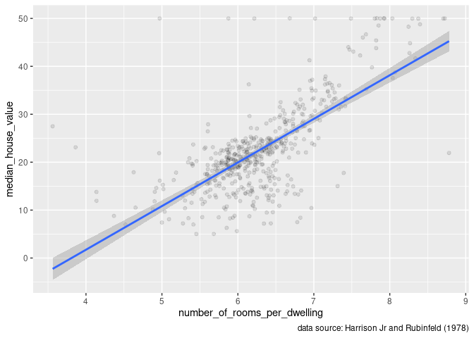
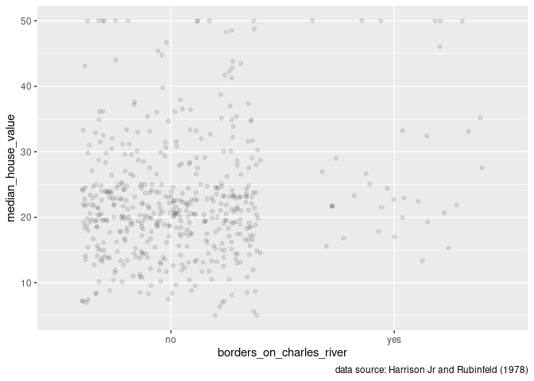
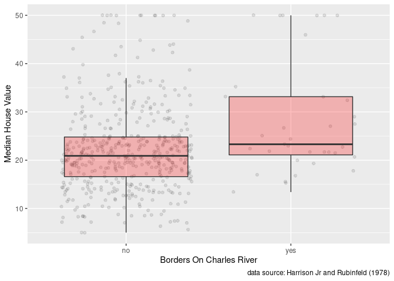

## Beginner level.

When performing data analysis, there are two main benefits of writing code when compared to using a point and click tool.

1.    Analysis based on code is [reproducible](https://www.youtube.com/watch?v=s3JldKoA0zw) and somewhat self-documented^[More true if you choose informative names for your objects and functions e.g. when you revisit code later, the meaning of `boston_covariates` is clearer than `bc`]: you and others (including future you) can easily redo the analysis if the underlying data changes, and your code describes how you got what you got. 
2.    Scaling: with point and click producing 100 similar plots would take you 100 times as long as making one plot.  With code, producing 100 similar plots would take just slightly more time than 1 plot... computers have a relative advantage at repeated tasks.

Writing functions is the primary way of scaling your analysis in R. Suppose that we wanted to create a series of plots that are almost identical (in terms of the code used to create), where the only thing that changes is the variable on the x axis.  Suppose we are interested in what variables influence housing prices, and we want to create scatter plots of every covariate in the `Boston` housing data set vs. `medv` (median house value):
 

```r
library(MASS)# for dataset Boston
library(tidyverse)# for ggplot() and other functions
library(janitor)# for clean_names()
library(kableExtra)# for making tables
(crim_plot <- ggplot(data=Boston, aes(x=crim, y=medv))+
    geom_point())
```

<!-- -->
 
and


```r
(nox_plot <- ggplot(data=Boston, aes(x=nox, y=medv))+
   geom_point())
```

<!-- -->

... etc, but cut/paste/modify is a bit tedious and prone to errrors... note that not much of the code is changing from plot to plot.  Furthermore, if we wanted to make a single modification, we would have to do that for all the plots individually.
In contrast, if we use a function to make these plots, then the change only needs to be made in one place: in the function. 

R functions are defined like this:


```r
name_of_function <- function(function_arguments){
  body_of_function
}
```

 Functions take the arguments as inputs and creates an output. The best way to write functions is to
 write code that works for a specific case and then modify it so it works more generally.
 e.g. above we wrote specific code that creates plots for `crim` and `nox`. This code becomes the template for 
 the body of the function, but rather than hardcoding in a value for `x` we use a variable a.k.a. function argument `x_variable` which could be *any* of the covariates in dataset Boston. We tell ggplot to look for `x_variable` as a column in `data` like this: `x=.data[[x_variable]]`


```r
make_scatter_plot <- function(x_variable){
  ggplot(data=Boston, aes(x=.data[[x_variable]], y=medv))+
    geom_point()
}
```

We can then call the function by name, including the variable/argument that we want on the x axis.


```r
make_scatter_plot("rm")
```

<!-- -->

These plots are acceptable for exploring the dataset, but it is kind of a pain not being able to tell what is on the axes.   
I am going to make a copy of Boston called boston^[remember, case matters in R so boston and Boston are two distinct objects] that I can "fix".

1.    The variable `chas` only has values 0/1, but R mistakenly thinks it is a real number. If a variable can only take on a limited number of values e.g. 0/1 or Apple/Banana/Cherry it should be coded as a `factor()`.
2.    I am going to drop an overtly racist variable. 
3.    I am going to replace the column names with something more meaningful.
4.    I am going to convert the meaningful [names](https://r4ds.had.co.nz/workflow-basics.html#whats-in-a-name) into a R friendly format using `clean_names()`.


```r
boston <- Boston%>%
  mutate(chas=factor(chas,labels=c("no","yes")))%>%
  select(-black)
better_names <- read_csv("boston_meta.csv") 
kbl(better_names)%>% 
  kable_styling(bootstrap_options = c("striped", "hover"), full_width = F)
```

<table class="table table-striped table-hover" style="width: auto !important; margin-left: auto; margin-right: auto;">
 <thead>
  <tr>
   <th style="text-align:left;"> short </th>
   <th style="text-align:left;"> long </th>
  </tr>
 </thead>
<tbody>
  <tr>
   <td style="text-align:left;"> crim </td>
   <td style="text-align:left;"> crime rate </td>
  </tr>
  <tr>
   <td style="text-align:left;"> zn </td>
   <td style="text-align:left;"> proportion large residential lots </td>
  </tr>
  <tr>
   <td style="text-align:left;"> indus </td>
   <td style="text-align:left;"> proportion non-retail business </td>
  </tr>
  <tr>
   <td style="text-align:left;"> chas </td>
   <td style="text-align:left;"> borders on Charles River </td>
  </tr>
  <tr>
   <td style="text-align:left;"> nox </td>
   <td style="text-align:left;"> nitrogen oxides concentration </td>
  </tr>
  <tr>
   <td style="text-align:left;"> rm </td>
   <td style="text-align:left;"> number of rooms per dwelling </td>
  </tr>
  <tr>
   <td style="text-align:left;"> age </td>
   <td style="text-align:left;"> proportion built prior to 1940 </td>
  </tr>
  <tr>
   <td style="text-align:left;"> dis </td>
   <td style="text-align:left;"> distance to work </td>
  </tr>
  <tr>
   <td style="text-align:left;"> rad </td>
   <td style="text-align:left;"> highway accessibility </td>
  </tr>
  <tr>
   <td style="text-align:left;"> tax </td>
   <td style="text-align:left;"> property-tax </td>
  </tr>
  <tr>
   <td style="text-align:left;"> ptratio </td>
   <td style="text-align:left;"> pupil-teacher ratio </td>
  </tr>
  <tr>
   <td style="text-align:left;"> lstat </td>
   <td style="text-align:left;"> low Socio Economic status </td>
  </tr>
  <tr>
   <td style="text-align:left;"> medv </td>
   <td style="text-align:left;"> median house value </td>
  </tr>
</tbody>
</table>

```r
colnames(boston) <- better_names$long #this replaces boston's column names with more informative (long) names
boston <- clean_names(boston) #eg. clean_names() converts "Arbitrary Column" to "arbitrary_column". 
```


If we use a function to make our plots and we want to make a change in a consistent way across all plots then we only need to modify the code in one place.  For example, we should probably add the source of the data: @harrison1978hedonic, there is a bit of over-plotting so lets use some transparency and jitter, and how about adding summary smooth to help guide the eye?

```r
make_scatter_plot <- function(x_variable){
   ggplot(data=boston, aes(x=.data[[x_variable]], y=median_house_value))+
      geom_jitter(alpha=.1)+
      geom_smooth(method="lm")+
      labs(caption="data source: Harrison Jr and Rubinfeld (1978)")
}
make_scatter_plot("number_of_rooms_per_dwelling")
```

<!-- -->

```r
make_scatter_plot("borders_on_charles_river")
```

<!-- -->

... etc, which is a little less tedious. Note that while the axes labels are more informative, they are not formatted very well. If you are not really psyched to be be learning R, feel free to stop here.  

## Intermediate level

Why does the `borders_on_charles_river` plot not have the smooth? Remember that we specified that `borders_on_charles_river` was a factor, and `geom_smooth()` does not work for factors.  Instead, lets add boxplots when the `x` variable is a factor. 


```r
make_scatter_plot <- function(x_variable){
  plt <- ggplot(data=boston, aes(x=.data[[x_variable]], y=median_house_value))+#Create base plot with raw data.
      geom_jitter(alpha=.1)
  if(is.factor(boston[[x_variable]])){# then add a boxplot if x_variable is factor
    plt <- plt+
      geom_boxplot(outlier.shape=NA,alpha=.25,fill="red")
  }else{# OTHERWISE add a smooth
    plt <- plt+
      geom_smooth(method="lm")
  }
  plt+ #Replace labels with human readable versions using function formatter() defined below
    labs(x=formatter(plt$labels$x),
         y=formatter(plt$labels$y),
         caption="data source: Harrison Jr and Rubinfeld (1978)")   
}
```

Below is the function `formatter()`, which takes a string and replaces _ with space and capitalizes. 

```r
formatter <- function(string){
  string%>%
    str_replace_all("_", " ")%>%
    str_to_title()
}
make_scatter_plot("borders_on_charles_river")
```

<!-- -->

## "Advanced" level:

In R we can be even more smazy^[smart *and* lazy]: we can "map" our function across the names of the variable we want on the x axis and keep the resulting plots organized in a single object, rather than cluttering up our global environment with a bunch of free floating objects. e.g `nox_plot`, `crim_plot`, etc.  Lets start by creating dataframe `all_my_plots` with a single column `boston_covariates` that contains all the column names of boston except `median_house_value`:


```r
all_my_plots <- tibble(boston_covariates=colnames(boston))%>%
  filter(boston_covariates!="median_house_value")
```

The following code maps each value of `boston_covariates` to our function `make_scatter_plot()` and saves the results as a new variable `scatter_plot` in original dataframe `all_my_plots`.


```r
all_my_plots <- all_my_plots%>%
  mutate(scatter_plot=map(boston_covariates, make_scatter_plot))
```

To display all scatter plots we `pull()` them out of the list-column `scatter_plot`


```r
all_my_plots%>%
  pull(scatter_plot)
```


<!-- -->


<!-- -->


<!-- -->


<!-- -->


<!-- -->


<!-- -->


<!-- -->


<!-- -->


<!-- -->


<!-- -->


<!-- -->


<!-- -->

Note that the payoff is not that large in this case: only 12 covariates, but you could imagine that hard coding 100 different plots would be excruciating, especially if you wanted to make a change after the 50th one. Note that there is no *explicit* iteration in the above code, it is all under the hood of the `map()` and `pull()` functions.

> Of course, someone has to write loops. It doesn’t have to be you. — Jenny Bryan

To access a single plot, e.g. the `nitrogen_oxides_concentration` plot we do the following:


```r
all_my_plots%>%
  filter(boston_covariates=="nitrogen_oxides_concentration")%>%
  pull(scatter_plot)
```


<!-- -->

# References

